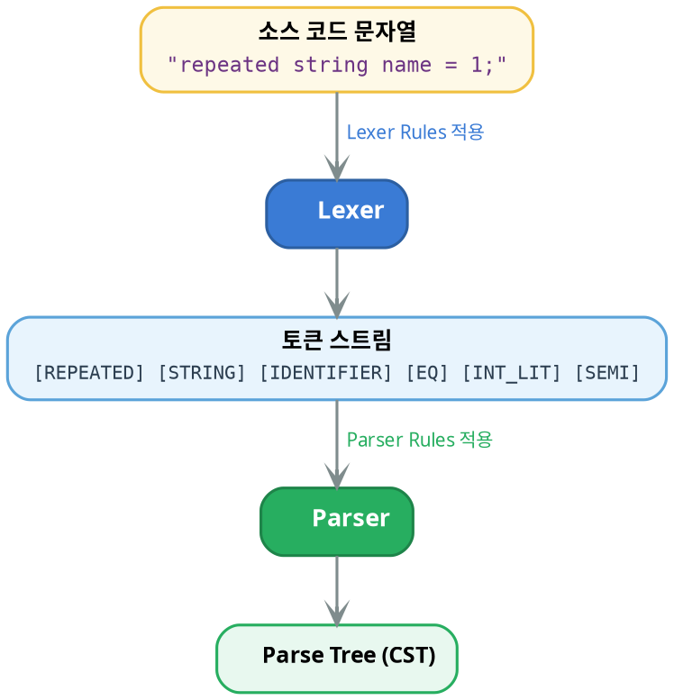

# ANTLR4 g4 문법 파일: 구조와 작성법

EBNF의 개념부터 시작하여 ANTLR4 g4 문법 파일의 구조, 작성법, 그리고 Protobuf3.g4 실전 분석까지 단계별로 설명합니다.

---

## 1. 형식 문법과 EBNF

### 질문
프로그래밍 언어의 문법을 기술하는 "형식 문법(Formal Grammar)"이란 무엇이며, BNF와 EBNF는 어떤 관계인가?

### 답변
형식 문법은 **어떤 문자열이 해당 언어에 속하는지**를 수학적으로 정의하는 규칙 집합입니다. 프로그래밍 언어의 파서를 만들려면 그 언어의 문법을 형식적으로 기술해야 합니다.

**BNF (Backus-Naur Form)**은 1960년대 ALGOL 언어를 정의하기 위해 만들어진 최초의 형식 문법 표기법입니다.

```
<field> ::= <label> <type> <name> "=" <number> ";"
<label> ::= "repeated" | "optional" | ""
```

BNF는 **반복과 선택적 요소를 직접 표현할 수 없어** 재귀로 우회해야 합니다.

```
<field_list> ::= <field> | <field> <field_list>
```

**EBNF (Extended BNF)**는 BNF에 반복(`*`, `+`), 선택(`?`), 그룹(`()`) 연산자를 추가하여 이 한계를 해결합니다.

```
field_list = { field } ;
field = [ label ] type name "=" number ";" ;
```

**BNF vs EBNF 비교:**

| 개념 | BNF | EBNF |
|------|-----|------|
| 0회 이상 반복 | 재귀로 표현 | `{ ... }` 또는 `*` |
| 1회 이상 반복 | 재귀로 표현 | `+` |
| 선택적 요소 | 빈 대안 추가 | `[ ... ]` 또는 `?` |
| 그룹화 | 별도 규칙 필요 | `( ... )` |
| 대안 | `\|` | `\|` (동일) |

ANTLR4의 g4 문법은 **EBNF의 변형**으로, EBNF의 모든 연산자를 지원하면서 정규 표현식 스타일 문법(`*`, `+`, `?`)을 사용합니다.

## 2. EBNF 핵심 연산자

### 질문
EBNF에서 사용하는 핵심 연산자들의 의미와 사용법은?

### 답변
EBNF의 연산자는 "**어떤 요소가 몇 번 나타날 수 있는가**"를 제어합니다. ANTLR4 g4에서 사용하는 표기법 기준으로 설명합니다.

**① 대안 (Alternation) — `|`**

여러 선택지 중 하나를 매칭합니다.

```antlr
topLevelDef
    : messageDef
    | enumDef
    | serviceDef
    ;
```

**② 선택적 (Optional) — `?`**

0회 또는 1회 나타날 수 있습니다.

```antlr
field
    : fieldLabel? type_ fieldName EQ fieldNumber SEMI
    ;
```

`fieldLabel`은 있어도 되고 없어도 됩니다. `repeated string name = 1;`에서 `repeated`가 있는 경우와 `string name = 1;`에서 없는 경우 모두 매칭됩니다.

**③ 0회 이상 반복 (Kleene Star) — `*`**

```antlr
proto
    : syntax (importStatement | packageStatement | topLevelDef)* EOF
    ;
```

`syntax` 선언 뒤에 import, package, 정의가 **0개 이상** 올 수 있습니다.

**④ 1회 이상 반복 (Kleene Plus) — `+`**

```antlr
IDENTIFIER
    : LETTER (LETTER | DECIMAL_DIGIT)*
    ;

fragment DECIMALS
    : DECIMAL_DIGIT+
    ;
```

`DECIMALS`는 숫자가 **최소 1개** 이상 있어야 합니다.

**⑤ 그룹화 (Grouping) — `( )`**

여러 요소를 하나로 묶어 연산자를 적용합니다.

```antlr
fieldOptions
    : fieldOption (COMMA fieldOption)*
    ;
```

`(COMMA fieldOption)*`은 "콤마 + 옵션"의 **쌍**이 0회 이상 반복됨을 의미합니다. `option1, option2, option3` 같은 콤마 구분 리스트를 매칭합니다.

**연산자 요약 표:**

| 연산자 | 의미 | 횟수 | 예시 |
|--------|------|------|------|
| `\|` | 대안 | 택 1 | `'true' \| 'false'` |
| `?` | 선택적 | 0..1 | `fieldLabel?` |
| `*` | 반복 | 0..N | `messageElement*` |
| `+` | 반복 | 1..N | `DECIMAL_DIGIT+` |
| `( )` | 그룹 | — | `(COMMA fieldOption)*` |

## 3. g4 파일의 기본 구조

### 질문
ANTLR4의 .g4 파일은 어떤 구조로 구성되며, 각 영역의 역할은 무엇인가?

### 답변
g4 파일은 크게 **4개 영역**으로 나뉩니다. Protobuf3.g4를 예로 들어 설명합니다.

**① grammar 선언**

```antlr
grammar Protobuf3;
```

파일명과 반드시 일치해야 합니다. `Protobuf3.g4` 파일이면 `grammar Protobuf3;`이어야 합니다. ANTLR은 이 이름으로 `Protobuf3Parser`, `Protobuf3Lexer` 클래스를 생성합니다.

**② options 블록**

```antlr
options {
    superClass = Protobuf3ParserBase;
}
```

파서의 부모 클래스, 토큰 사전 등을 지정합니다. `superClass`는 생성된 파서가 상속할 커스텀 기반 클래스를 지정합니다.

**③ Parser Rules (소문자로 시작)**

```antlr
proto
    : syntax (importStatement | packageStatement | topLevelDef)* EOF
    ;

messageDef
    : MESSAGE messageName messageBody
    ;
```

파서 규칙은 **토큰 스트림의 구조적 관계**를 정의합니다. 소문자로 시작하는 이름이 규칙입니다.

**④ Lexer Rules (대문자로 시작)**

```antlr
MESSAGE : 'message' ;
SEMI    : ';' ;
INT_LIT : DECIMAL_LIT | OCTAL_LIT | HEX_LIT ;

fragment DECIMAL_LIT
    : ([1-9]) DECIMAL_DIGIT*
    ;
```

렉서 규칙은 **문자 스트림을 토큰으로 분리**하는 패턴을 정의합니다. 대문자로 시작하는 이름이 규칙입니다.

**g4 파일의 전체 구조:**

| 구성 요소 | 예시 |
|-----------|------|
| **grammar 선언** | grammar Protobuf3; |
| **options / header** | options { superClass = ... } |
| **Parser Rules (소문자)** — 문법의 구조 정의, 토큰을 조합하여 트리 생성 | proto, messageDef, field, ... |
| **Lexer Rules (대문자)** — 문자→토큰 변환, fragment: 내부 헬퍼 | MESSAGE, SEMI, INT_LIT, ... |

## 4. Parser Rule vs Lexer Rule

### 질문
파서 규칙과 렉서 규칙은 어떻게 다르며, 왜 구분하는가?

### 답변
가장 근본적인 차이는 **처리 대상**입니다.

| 구분 | Lexer Rule | Parser Rule |
|------|-----------|-------------|
| 이름 규칙 | **대문자**로 시작 | **소문자**로 시작 |
| 입력 | 문자 스트림 (char) | 토큰 스트림 (token) |
| 출력 | 토큰 | Parse Tree 노드 |
| 역할 | "무엇이 단어인가" | "단어가 어떤 문장을 이루는가" |
| 실행 시점 | 파서보다 **먼저** | 렉서 **이후** |

**처리 흐름:**



**fragment 규칙 — 렉서 전용 헬퍼:**

`fragment`가 붙은 렉서 규칙은 **독립된 토큰을 생성하지 않습니다**. 다른 렉서 규칙 내부에서만 재사용됩니다.

```antlr
INT_LIT
    : DECIMAL_LIT | OCTAL_LIT | HEX_LIT
    ;

fragment DECIMAL_LIT       // ← 독립 토큰 안 됨
    : ([1-9]) DECIMAL_DIGIT*
    ;

fragment DECIMAL_DIGIT     // ← 독립 토큰 안 됨
    : [0-9]
    ;
```

`DECIMAL_DIGIT`는 토큰이 아니라 `INT_LIT`를 구성하는 **빌딩 블록**입니다. 파서에서 `DECIMAL_DIGIT`를 직접 참조할 수 없습니다.

**keywords 규칙 — 예약어 처리:**

```antlr
ident
    : IDENTIFIER
    | keywords       // ← 예약어도 식별자로 쓰일 수 있음
    ;

keywords
    : SYNTAX | IMPORT | MESSAGE | ENUM | ...
    ;
```

Protobuf3에서는 `message`라는 이름의 필드를 허용합니다. `keywords` 파서 규칙을 통해 예약어가 문맥에 따라 식별자로도 매칭되도록 합니다.

## 5. g4 문법의 핵심 패턴

### 질문
g4 문법을 작성할 때 자주 사용하는 패턴에는 어떤 것들이 있는가?

### 답변
실전 g4 문법에서 반복적으로 등장하는 핵심 패턴 5가지를 정리합니다.

**① 콤마 구분 리스트 (Comma-Separated List)**

```antlr
fieldOptions
    : fieldOption (COMMA fieldOption)*
    ;

ranges
    : range_ (COMMA range_)*
    ;
```

`첫_요소 (구분자 요소)*` 패턴은 `a, b, c` 형태의 리스트를 표현합니다. 최소 1개 요소가 보장됩니다.

**② 블록 감싸기 (Block Wrapping)**

```antlr
messageBody
    : LC messageElement* RC
    ;

enumBody
    : LC enumElement* RC
    ;
```

`여는괄호 내용물* 닫는괄호` 패턴으로 `{ ... }` 블록을 표현합니다.

**③ 재귀적 정의 (Recursive Definition)**

```antlr
messageElement
    : field
    | enumDef        // ← enum을 포함
    | messageDef     // ← 다른 message를 포함 (재귀!)
    | oneof
    | mapField
    | reserved
    ;
```

`messageDef`가 `messageBody` → `messageElement` → `messageDef`를 다시 참조하여 **중첩 메시지**를 표현합니다.

```protobuf
message Outer {
    message Inner {        // ← 재귀적 중첩
        string value = 1;
    }
    Inner data = 1;
}
```

**④ 래퍼 규칙 (Wrapper Rule)**

```antlr
messageName : ident ;
enumName    : ident ;
fieldName   : ident ;
serviceName : ident ;
```

문법적으로는 모두 `ident`이지만, **의미적 역할**을 구분하기 위해 별도 규칙으로 감쌉니다. Visitor에서 `VisitMessageName()`과 `VisitFieldName()`을 구분하여 처리할 수 있습니다.

**⑤ 타입 참조 (Qualified Name)**

```antlr
messageType
    : (DOT)? (ident DOT)* messageName
    ;
```

`.google.protobuf.Timestamp`처럼 점으로 구분된 정규화 이름(fully qualified name)을 매칭합니다.

- `.`으로 시작: 절대 경로
- `ident.`이 0회 이상: 패키지/네임스페이스 경로
- 마지막 `messageName`: 실제 타입 이름

## 6. Protobuf3.g4 규칙 계층 분석

### 질문
Protobuf3.g4의 파서 규칙들은 어떤 계층 구조를 이루고 있으며, 전체적인 문법 구조는 어떻게 되어 있는가?

### 답변
Protobuf3.g4의 파서 규칙은 `proto`를 루트로 하는 **트리 구조**를 이룹니다. 주요 규칙의 계층을 분석합니다.

**최상위 구조:**

```antlr
proto
    : syntax (importStatement | packageStatement | optionStatement
             | topLevelDef | emptyStatement_)* EOF
    ;
```

proto 파일은 반드시 `syntax = "proto3";`로 시작하고, 그 뒤에 import, package, option, 정의(message/enum/service)가 자유롭게 나옵니다.

**topLevelDef — 핵심 분기점:**

```antlr
topLevelDef
    : messageDef    // message Foo { ... }
    | enumDef       // enum Bar { ... }
    | extendDef     // extend Foo { ... }
    | serviceDef    // service Baz { ... }
    ;
```

실제 프로젝트에서 가장 많이 사용하는 것은 `messageDef`와 `enumDef`입니다.

**messageDef 상세 분해:**

```antlr
messageDef    → MESSAGE messageName messageBody
messageBody   → LC messageElement* RC
messageElement → field | enumDef | messageDef | oneof | mapField | reserved | ...
field         → fieldLabel? type_ fieldName EQ fieldNumber (LB fieldOptions RB)? SEMI
```

이 계층을 실제 protobuf 코드에 대입하면:

```protobuf
message Player {                    // messageDef
    string name = 1;               // field (label 없음)
    repeated Item items = 2;       // field (label: repeated)
    enum Status {                  // enumDef (중첩)
        ACTIVE = 0;
        INACTIVE = 1;
    }
    Status status = 3;             // field (type: enumType)
}
```

**field 규칙의 각 요소:**

| g4 요소 | 역할 | 예시 |
|---------|------|------|
| `fieldLabel?` | 필드 한정자 (선택적) | `repeated`, `optional` |
| `type_` | 필드 타입 | `string`, `int32`, `Player` |
| `fieldName` | 필드 이름 | `name`, `items` |
| `EQ` | 구분자 | `=` |
| `fieldNumber` | 필드 번호 | `1`, `2`, `3` |
| `(LB fieldOptions RB)?` | 필드 옵션 (선택적) | `[deprecated = true]` |
| `SEMI` | 종결자 | `;` |

## 7. Semantic Predicate와 Action

### 질문
g4 문법에서 `{ this.IsNotKeyword() }?` 같은 코드가 등장하는데, 이것은 무엇이며 왜 필요한가?

### 답변
이것은 **Semantic Predicate**(의미적 술어)라고 합니다. 문법 규칙만으로는 표현할 수 없는 **문맥 의존적 판단**을 프로그래밍 코드로 보완합니다.

**Semantic Predicate — `{ 조건 }?`**

`?`로 끝나는 중괄호 블록은 **조건이 true일 때만 해당 대안을 시도**합니다.

```antlr
type_
    : DOUBLE | FLOAT | INT32 | ...    // 기본 타입 (키워드)
    | { this.IsNotKeyword() }? messageType   // 사용자 정의 타입
    | { this.IsNotKeyword() }? enumType      // 사용자 정의 enum 타입
    ;
```

왜 필요한가? `message`라는 단어는 키워드(`MESSAGE` 토큰)이지만, 타입 위치에서는 사용자 정의 메시지 이름일 수 있습니다. `IsNotKeyword()`는 현재 토큰이 예약어가 아닌지 확인하여 **키워드와 식별자의 충돌을 해결**합니다.

**Action — `{ 코드 }`**

`?` 없이 중괄호만 있는 블록은 **해당 지점을 지날 때 실행되는 코드**입니다.

```antlr
importStatement
    : IMPORT (WEAK | PUBLIC)? strLit SEMI { this.DoImportStatement_(); }
    ;

messageBody
    : LC doEnterBlock messageElement* RC doExitBlock
    ;

doEnterBlock : { this.DoEnterBlock_(); } ;
doExitBlock  : { this.DoExitBlock_(); } ;
```

Protobuf3.g4에서 Action은 주로 **2-pass 파싱**을 위한 상태 관리에 사용됩니다.

| Action 규칙 | 역할 |
|------------|------|
| `doEnterBlock` | 블록 진입 시 스코프 스택 push |
| `doExitBlock` | 블록 이탈 시 스코프 스택 pop |
| `doMessageNameDef` | 메시지 이름을 심볼 테이블에 등록 |
| `doEnumNameDef` | enum 이름을 심볼 테이블에 등록 |
| `DoImportStatement_` | import된 파일을 파싱 큐에 추가 |
| `DoRewind` | 2-pass를 위해 토큰 스트림 되감기 |

**Predicate vs Action 비교:**

| 구분 | Semantic Predicate | Action |
|------|-------------------|--------|
| 문법 | `{ 조건 }?` | `{ 코드 }` 또는 규칙으로 분리 |
| 실행 시점 | 파싱 **결정 전** | 파싱 **진행 중** |
| 역할 | 대안 선택에 영향 | 부수 효과 (상태 변경) |
| 예시 | `IsNotKeyword()` | `DoEnterBlock_()` |

## 8. g4 문법 작성 팁과 주의사항

### 질문
g4 문법을 직접 작성하거나 수정할 때 알아야 할 핵심 팁과 흔한 함정은?

### 답변

**① 좌재귀 (Left Recursion) — ANTLR4는 허용**

```antlr
// 직접 좌재귀 — ANTLR4에서 허용됨
expr
    : expr PLUS expr    // 좌재귀
    | expr STAR expr
    | INT_LIT
    ;
```

ANTLR4는 직접 좌재귀를 자동 변환합니다. 단, **간접 좌재귀**(A → B → A)는 지원하지 않으므로 수동으로 제거해야 합니다.

**② 렉서 규칙의 우선순위**

렉서 규칙은 **정의 순서**가 우선순위입니다. 같은 입력에 매칭되는 규칙이 여러 개면 **먼저 정의된 규칙**이 이깁니다.

```antlr
MESSAGE : 'message' ;   // 먼저 정의 → 'message'는 항상 MESSAGE 토큰
IDENTIFIER : LETTER (LETTER | DECIMAL_DIGIT)* ;  // 나중 정의
```

`message`라는 입력은 `IDENTIFIER`가 아닌 `MESSAGE` 토큰이 됩니다. 키워드를 식별자보다 **먼저** 정의해야 하는 이유입니다.

**③ 가장 긴 매칭 (Longest Match)**

렉서는 가능한 한 **가장 긴 토큰**을 만듭니다.

```antlr
FLOAT_LIT : DECIMALS DOT DECIMALS? EXPONENT? | ... ;
INT_LIT   : DECIMAL_LIT | OCTAL_LIT | HEX_LIT ;
```

`3.14`라는 입력에서 렉서는 `INT_LIT(3)` + `DOT` + `INT_LIT(14)`가 아닌 `FLOAT_LIT(3.14)`를 생성합니다.

**④ skip과 channel**

```antlr
WS           : [ \t\r\n]+ -> skip ;          // 완전히 버림
LINE_COMMENT : '//' ~[\r\n]* -> channel(HIDDEN) ;  // 숨김 채널
COMMENT      : '/*' .*? '*/' -> channel(HIDDEN) ;   // 숨김 채널
```

- `skip`: 토큰 스트림에서 **완전히 제거** — 파서가 볼 수 없음
- `channel(HIDDEN)`: 파서는 무시하지만 **토큰 스트림에 존재** — 주석 보존, 포매터 등에서 활용

**⑤ `.*?` — Non-greedy 매칭**

```antlr
COMMENT : '/*' .*? '*/' ;   // ← non-greedy
```

`.*?`는 **최소한**으로 매칭합니다. `/* a */ b /* c */`에서 `/* a */`만 매칭합니다. `.*`(greedy)를 쓰면 `/* a */ b /* c */` 전체가 하나의 토큰이 됩니다.

**⑥ 문법 분리 — Lexer Grammar vs Combined Grammar**

```antlr
// Combined Grammar (하나의 파일)
grammar Protobuf3;        // 파서 + 렉서 모두 포함

// 분리된 Grammar (두 개의 파일)
lexer grammar Protobuf3Lexer;   // 렉서만
parser grammar Protobuf3Parser; // 파서만, tokenVocab = Protobuf3Lexer
```

Protobuf3.g4는 **Combined Grammar**입니다. 규모가 커지면 Lexer/Parser를 분리하여 관리합니다.
