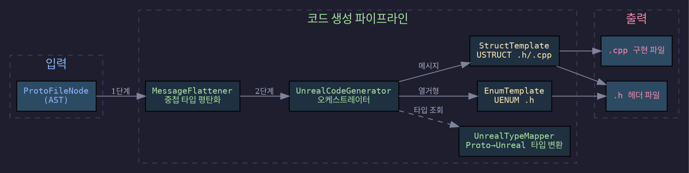
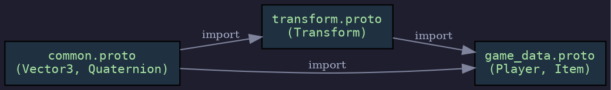

# AST → Unreal C++ 코드 생성: 추상 구문 트리에서 USTRUCT/UENUM까지

CST→AST 변환이 완료된 후, AST 노드를 Unreal Engine C++ 코드(`.h`/`.cpp`)로 변환하는 전 과정을 단계별로 설명합니다.

---

## 1. 코드 생성 파이프라인 전체 흐름

### 질문
AST가 완성된 후 최종 `.h`/`.cpp` 파일이 출력되기까지 어떤 단계를 거치는가?

### 답변
코드 생성 파이프라인은 AST 이후 5단계로 구성됩니다. 각 단계는 독립된 C# 클래스가 담당합니다.



**각 단계의 역할:**

| 단계 | 클래스 | 입력 | 출력 |
|------|--------|------|------|
| ① 평탄화 | `MessageFlattener` | `ProtoFileNode` (중첩 구조) | `ProtoFileNode` (평탄 구조) |
| ② 오케스트레이션 | `UnrealCodeGenerator` | 평탄화된 AST | `GeneratedCodeResult` |
| ③ 타입 매핑 | `UnrealTypeMapper` | proto3 타입명 | Unreal C++ 타입명 |
| ④ 구조체 생성 | `StructTemplate` | `MessageNode` | `.h` 헤더 + `.cpp` 마샬링 |
| ⑤ 열거형 생성 | `EnumTemplate` | `EnumNode` | `.h` 헤더 |

전체 파이프라인을 `ProtoCompiler.Compile()`이 조율합니다:

```csharp
// ProtoCompiler.cs — 핵심 루프
foreach (var orderedFile in orderedFiles)
{
    var ast = _parser.Parse(orderedFile.Content, orderedFile.FileName);
    _flattener.Flatten(ast);                    // ① 평탄화
    var result = _codeGenerator.Generate(ast);   // ②③④⑤ 코드 생성
    foreach (var generatedFile in result.AllFiles)
        File.WriteAllText(filePath, generatedFile.Content);
}
```

## 2. MessageFlattener — 중첩 타입 평탄화

### 질문
proto3의 중첩 메시지/열거형은 왜 평탄화가 필요하며, 어떻게 변환되는가?

### 답변
proto3는 메시지 안에 메시지를 중첩할 수 있지만, Unreal Engine의 USTRUCT/UENUM은 **중첩 정의를 지원하지 않습니다**. 따라서 모든 중첩 타입을 최상위로 끌어올려야 합니다.

**입력 예시:**
```protobuf
message Player {
    string name = 1;
    Stats stats = 2;

    message Stats {         // 중첩 메시지
        int32 hp = 1;
        int32 mp = 2;
    }

    enum Rank {             // 중첩 열거형
        BRONZE = 0;
        SILVER = 1;
    }
}
```

**평탄화 후 AST 상태:**

| 원본 이름 | `FullName` (Unreal) | `ProtocTypeName` (protoc C++) | 용도 |
|-----------|---------------------|-------------------------------|------|
| `Player` | `Player` | `Player` | Unreal 타입명 생성용 |
| `Player.Stats` | `PlayerStats` | `Player_Stats` | Unreal: `FPlayerStatsProto` |
| `Player.Rank` | `PlayerRank` | — | Unreal: `EPlayerRankProto` |

**두 가지 이름이 필요한 이유:**
- **`FullName`** — Unreal 네이밍에 사용. 언더스코어 없이 연결 (`PlayerStats`)
- **`ProtocTypeName`** — protoc가 생성하는 C++ 클래스명. 언더스코어로 구분 (`Player_Stats`). 마샬링 생성자에서 protoc 타입을 참조할 때 사용

**필드 타입 참조 갱신:**
평탄화 시 부모 메시지의 필드 타입도 함께 갱신됩니다:

```
// 평탄화 전
Player.Fields[1].Type = "Stats"         ← 단순명

// 평탄화 후
Player.Fields[1].Type = "PlayerStats"   ← 평탄화된 전체명
```

이 갱신이 없으면 `UnrealTypeMapper`가 `Stats`를 독립 타입으로 착각합니다.

**재귀 평탄화:**
3단계 이상 중첩도 재귀적으로 처리됩니다:

```
Outer.Middle.Inner
  → FullName: "OuterMiddleInner"
  → ProtocTypeName: "Outer_Middle_Inner"
```

## 3. UnrealTypeMapper — 타입 변환 테이블

### 질문
proto3 타입은 Unreal C++ 타입으로 어떻게 매핑되는가?

### 답변
`UnrealTypeMapper`는 `ITypeMapper` 인터페이스를 구현하며, 4가지 변환 기능을 제공합니다.

**① 스칼라 타입 매핑 (`PrimitiveTypeMap`):**

| proto3 타입 | Unreal C++ 타입 | 비고 |
|-------------|----------------|------|
| `int32` | `int32` | 직접 대응 |
| `int64` | `int64` | 직접 대응 |
| `uint32` | `uint32` | 직접 대응 |
| `uint64` | `uint64` | 직접 대응 |
| `sint32` | `int32` | ZigZag 인코딩 (런타임 차이만) |
| `sint64` | `int64` | ZigZag 인코딩 |
| `fixed32` | `uint32` | 고정 길이 인코딩 |
| `fixed64` | `uint64` | 고정 길이 인코딩 |
| `sfixed32` | `int32` | 고정 길이 부호 있음 |
| `sfixed64` | `int64` | 고정 길이 부호 있음 |
| `float` | `float` | 직접 대응 |
| `double` | `double` | 직접 대응 |
| `bool` | `bool` | 직접 대응 |
| `string` | `FString` | Unreal 문자열 |
| `bytes` | `TArray<uint8>` | 바이트 배열 |

**② 컨테이너 타입 래핑:**

| proto3 수식자 | Unreal C++ 래핑 | 예시 |
|---------------|----------------|------|
| `repeated T` | `TArray<T>` | `repeated string` → `TArray<FString>` |
| `map<K, V>` | `TMap<K, V>` | `map<string, int32>` → `TMap<FString, int32>` |
| `optional T` | `TOptional<T>` | `optional int32` → `TOptional<int32>` |

**③ 사용자 정의 타입 변환 (`NamingHelper`):**

| 대상 | 접두사 | 접미사 | 예시 |
|------|--------|--------|------|
| 메시지 → 구조체 | `F` | `Proto` | `Player` → `FPlayerProto` |
| 열거형 | `E` | `Proto` | `Status` → `EStatusProto` |
| 출력 파일명 | `ME` | `Proto` | `Player` → `MEPlayerProto.h/.cpp` |
| 필드명 | — | — | `player_name` → `PlayerName` (PascalCase) |
| 열거형 값 | — | — | `ACTIVE_STATE` → `ActiveState` (PascalCase) |

**④ `MapFieldType()` 분기 로직:**

```
MapFieldType(field)
├── field.IsMap?         → TMap<MapKey, MapValue>
├── IsPrimitive(type)?
│   ├── field.IsRepeated? → TArray<primitiveType>
│   └── 그 외             → primitiveType
├── IsEnum/IsMessage?
│   ├── field.IsRepeated? → TArray<FTypeProto/ETypeProto>
│   └── 그 외             → FTypeProto/ETypeProto
└── (IsOptional || IsOneOf) && !IsRepeated?
    └── TOptional<위 결과>  로 래핑
```

## 4. EnumTemplate — UENUM 헤더 생성

### 질문
`EnumNode`는 어떤 Unreal Engine C++ 코드로 변환되는가?

### 답변
`EnumTemplate.GenerateHeader()`는 `EnumNode` AST 노드를 UENUM 헤더 파일로 변환합니다. `.cpp` 파일은 생성하지 않습니다 (열거형은 헤더에서 완전히 정의됨).

**입력 AST:**
```
EnumNode
├── Name: "PlayerState"
├── FullName: "PlayerState"
└── Values: [
      EnumValueNode(Name="UNKNOWN",  Value=0),
      EnumValueNode(Name="ACTIVE",   Value=1),
      EnumValueNode(Name="INACTIVE", Value=2)
    ]
```

**출력 `.h` 파일 (`MEPlayerStateProto.h`):**
```cpp
// AUTO-GENERATED — DO NOT EDIT
// Source: game_data.proto

#pragma once

#include "CoreMinimal.h"
#include "MEPlayerStateProto.generated.h"

UENUM(BlueprintType)
enum class EPlayerStateProto : uint8
{
    Unknown = 0 UMETA(DisplayName = "Unknown"),
    Active = 1 UMETA(DisplayName = "Active"),
    Inactive = 2 UMETA(DisplayName = "Inactive")
};
```

**변환 규칙 정리:**

| 요소 | proto3 | Unreal C++ |
|------|--------|------------|
| 타입명 | `PlayerState` | `EPlayerStateProto` (`E` + PascalCase + `Proto`) |
| 기반 타입 | — | `: uint8` (Blueprint 호환 필수) |
| 값 이름 | `UNKNOWN` | `Unknown` (PascalCase) |
| 메타데이터 | — | `UMETA(DisplayName = "...")` |
| 구분자 | — | 마지막 값 제외 쉼표 |

**`FileHeaderTemplate`이 생성하는 헤더 주석:**
```cpp
// AUTO-GENERATED — DO NOT EDIT
// Source: game_data.proto
```

모든 출력 파일의 최상단에 이 주석이 삽입되어, 수동 편집을 방지합니다.

## 5. StructTemplate — USTRUCT 헤더 생성

### 질문
`MessageNode`는 어떤 Unreal Engine C++ 헤더 파일로 변환되는가?

### 답변
`StructTemplate.GenerateHeader()`는 `MessageNode` AST 노드를 USTRUCT 헤더 파일로 변환합니다.

**입력 AST:**
```
MessageNode
├── Name: "Player"
├── FullName: "Player"
├── ProtocTypeName: "Player"
├── Dependencies: ["common"]
└── Fields: [
      FieldNode(Name="name",      Type="string",  Number=1),
      FieldNode(Name="level",     Type="int32",   Number=2),
      FieldNode(Name="inventory", Type="string",  Number=3, IsRepeated=true),
      FieldNode(Name="status",    Type="PlayerState", Number=4, IsEnum=true)
    ]
```

**출력 `.h` 파일 (`MEPlayerProto.h`):**
```cpp
// AUTO-GENERATED — DO NOT EDIT
// Source: game_data.proto

#pragma once

#include "CoreMinimal.h"
#include "MECommonProto.h"
#include "MEPlayerProto.generated.h"

USTRUCT(BlueprintType)
struct FPlayerProto
{
    GENERATED_BODY()

    FPlayerProto() = default;

    // Marshal from protobuf message
    explicit FPlayerProto(const ::Player& proto);

    UPROPERTY(EditAnywhere, BlueprintReadWrite, Category = "Proto")
    FString Name;

    UPROPERTY(EditAnywhere, BlueprintReadWrite, Category = "Proto")
    int32 Level;

    UPROPERTY(EditAnywhere, BlueprintReadWrite, Category = "Proto")
    TArray<FString> Inventory;

    UPROPERTY(EditAnywhere, BlueprintReadWrite, Category = "Proto")
    EPlayerStateProto Status;
};
```

**헤더 파일의 구조:**

| 영역 | 내용 | 담당 메서드/클래스 |
|------|------|-------------------|
| 주석 헤더 | `AUTO-GENERATED` 경고 | `FileHeaderTemplate.Generate()` |
| `#pragma once` | 중복 포함 방지 | `StructTemplate.GenerateHeader()` |
| `#include` 체인 | CoreMinimal + 의존성 + `.generated.h` | `ExtractDependencies()` |
| USTRUCT 선언 | `USTRUCT(BlueprintType)` | 고정 문자열 |
| 기본 생성자 | `= default` | 고정 문자열 |
| 마샬링 생성자 선언 | `explicit F...(const ::Type& proto)` | `BuildProtocFullTypeName()` |
| UPROPERTY 필드 | `UPROPERTY(...)` + 타입 + 이름 | `MapFieldType()` + `BuildUPropertyAttribute()` |

**`UPROPERTY` 속성 구성:**
`CodeGeneratorOptions`로 제어됩니다:

```csharp
// 기본값
PropertySpecifier = "EditAnywhere"
GenerateBlueprintReadWrite = true
CategoryName = "Proto"
// 결과: UPROPERTY(EditAnywhere, BlueprintReadWrite, Category = "Proto")
```

**마샬링 생성자의 protoc 타입 참조:**
`BuildProtocFullTypeName()`이 패키지 유무에 따라 완전한 C++ 네임스페이스를 생성합니다:

| 패키지 | ProtocTypeName | 결과 |
|--------|---------------|------|
| (없음) | `Player` | `::Player` |
| `game` | `Player` | `game::Player` |
| `foo.bar` | `Player_Stats` | `foo::bar::Player_Stats` |

## 6. StructTemplate — 마샬링 생성자 생성

### 질문
마샬링 생성자(`.cpp`)는 필드 타입에 따라 어떻게 다른 코드를 생성하는가?

### 답변
`StructTemplate.GenerateCpp()`는 각 필드의 타입과 수식자를 분석하여 **8가지 패턴** 중 하나의 C++ 마샬링 코드를 생성합니다.

**출력 `.cpp` 파일 (`MEPlayerProto.cpp`):**
```cpp
// AUTO-GENERATED — DO NOT EDIT
// Source: game_data.proto

#include "MEPlayerProto.h"
#include "game_data.pb.h"

FPlayerProto::FPlayerProto(const ::Player& proto)
{
    Name = FString(UTF8_TO_TCHAR(proto.name().c_str()));
    Level = proto.level();
    Inventory.Reserve(proto.inventory_size());
    for (int i = 0; i < proto.inventory_size(); ++i)
    {
        Inventory.Add(FString(UTF8_TO_TCHAR(proto.inventory(i).c_str())));
    }
    Status = static_cast<EPlayerStateProto>(proto.status());
}
```

**8가지 마샬링 패턴:**

| # | 조건 | 생성 코드 패턴 | 예시 |
|---|------|---------------|------|
| 1 | `string` | `FString(UTF8_TO_TCHAR(proto.x().c_str()))` | UTF-8 → TCHAR 변환 |
| 2 | 프리미티브 (int32, bool 등) | `proto.x()` | 직접 대입 |
| 3 | `bytes` | `SetNum` + `FMemory::Memcpy` 3줄 패턴 | 바이트 배열 복사 |
| 4 | `repeated T` | `Reserve` + `for` 루프 + `Add` | 배열 순회 |
| 5 | `map<K, V>` | `for (const auto& [key, value] : ...)` | 구조적 바인딩 |
| 6 | `optional` / `oneof` | `if (proto.has_x()) { ... }` 가드 | 존재 여부 체크 |
| 7 | 열거형 | `static_cast<ETypeProto>(proto.x())` | 정수 → enum 캐스팅 |
| 8 | 메시지 (사용자 정의 타입) | `FTypeProto(proto.x())` | 재귀 마샬링 생성자 |

각 패턴의 상세 코드는 아래 인터랙티브 Stepper에서 단계별로 확인할 수 있습니다.

## 7. 의존성 해결과 #include 체인

### 질문
여러 `.proto` 파일 간의 import 관계는 어떻게 처리되는가?

### 답변
두 가지 수준의 의존성 해결이 존재합니다:

**① 파일 수준 — `DependencyGraph` (Kahn 알고리즘 위상 정렬)**

여러 `.proto` 파일을 올바른 순서로 컴파일하기 위해 위상 정렬을 수행합니다.



**위상 정렬 결과:** `common` → `transform` → `game_data`

**알고리즘 흐름:**
1. 각 파일의 진입 차수(in-degree) 계산 — 이 파일이 import하는 파일 수
2. 진입 차수 0인 파일부터 큐에 넣음
3. 큐에서 꺼내며 의존하는 파일의 진입 차수 감소
4. 모든 파일 처리 완료 시 정렬 완료, 그렇지 않으면 순환 의존 에러

**순환 의존 감지:**
정렬 결과의 파일 수가 전체 파일 수와 다르면 `CircularDependencyException`을 발생시킵니다.

**② 타입 수준 — `ExtractDependencies()` (#include 생성)**

개별 메시지의 필드에서 사용하는 사용자 정의 타입을 분석하여 `#include` 목록을 생성합니다.

```csharp
// UnrealCodeGenerator.ExtractDependencies()
foreach (var field in message.Fields)
{
    if (field.IsMap && !IsPrimitiveType(field.MapValueType))
        dependencyFileNames.Add(GetOutputFileName(field.MapValueType));
    else if (!IsPrimitiveType(field.Type))
        dependencyFileNames.Add(GetOutputFileName(field.Type));
}
dependencyFileNames.Remove(selfFileName); // 자기 참조 제거
```

**예시:**
`Player` 메시지가 `Transform` 타입 필드를 가지면:
```cpp
#include "METransformProto.h"   // ← ExtractDependencies()가 추가
```

**protoc 헤더 include:**
마샬링 생성자의 `.cpp` 파일에는 protoc가 생성한 헤더도 포함됩니다:
```cpp
#include "game_data.pb.h"       // ← NamingHelper.ToProtocHeaderName()
```

## 8. 전체 입출력 예시 추적

### 질문
실제 `.proto` 파일이 각 단계를 거쳐 최종 `.h`/`.cpp` 파일이 되는 전체 과정은?

### 답변
`game_data.proto` 파일을 예시로 전 과정을 추적합니다.

**입력:**
```protobuf
syntax = "proto3";
package game;
import "common.proto";

enum PlayerState {
    UNKNOWN = 0;
    ACTIVE  = 1;
}

message Player {
    string     name      = 1;
    int32      level     = 2;
    bool       is_online = 3;
    bytes      avatar    = 4;
    repeated   string    tags = 5;
    map<string, int32>   scores = 6;
    optional   float     rating = 7;
    PlayerState state    = 8;
    Stats      stats     = 9;

    message Stats {
        int32 hp = 1;
        int32 mp = 2;
    }
}
```

**① 파싱 → AST:**
```
ProtoFileNode
├── Package: "game"
├── Imports: ["common.proto"]
├── Enums: [EnumNode("PlayerState", [UNKNOWN=0, ACTIVE=1])]
└── Messages: [
      MessageNode("Player", Fields=[9개], NestedMessages=[
        MessageNode("Stats", Fields=[hp, mp])
      ])
    ]
```

**② MessageFlattener — 평탄화:**
```
ProtoFileNode
├── Enums: [EnumNode(FullName="PlayerState")]
└── Messages: [
      MessageNode(FullName="Player",      ProtocTypeName="Player"),
      MessageNode(FullName="PlayerStats", ProtocTypeName="Player_Stats")  ← 승격
    ]
// Player.Fields[8].Type = "Stats" → "PlayerStats" (갱신됨)
```

**③ UnrealCodeGenerator — 코드 생성:**

출력 파일 목록:

| 타입 | 파일명 | 내용 |
|------|--------|------|
| `EPlayerStateProto` | `MEPlayerStateProto.h` | UENUM 헤더 |
| `FPlayerProto` | `MEPlayerProto.h` | USTRUCT 헤더 |
| `FPlayerProto` | `MEPlayerProto.cpp` | 마샬링 생성자 |
| `FPlayerStatsProto` | `MEPlayerStatsProto.h` | USTRUCT 헤더 |
| `FPlayerStatsProto` | `MEPlayerStatsProto.cpp` | 마샬링 생성자 |

**④ 최종 출력 — `MEPlayerProto.h`:**
```cpp
#pragma once

#include "CoreMinimal.h"
#include "MEPlayerStateProto.h"
#include "MEPlayerStatsProto.h"
#include "MEPlayerProto.generated.h"

USTRUCT(BlueprintType)
struct FPlayerProto
{
    GENERATED_BODY()

    FPlayerProto() = default;

    explicit FPlayerProto(const game::Player& proto);

    UPROPERTY(EditAnywhere, BlueprintReadWrite, Category = "Proto")
    FString Name;

    UPROPERTY(EditAnywhere, BlueprintReadWrite, Category = "Proto")
    int32 Level;

    UPROPERTY(EditAnywhere, BlueprintReadWrite, Category = "Proto")
    bool IsOnline;

    UPROPERTY(EditAnywhere, BlueprintReadWrite, Category = "Proto")
    TArray<uint8> Avatar;

    UPROPERTY(EditAnywhere, BlueprintReadWrite, Category = "Proto")
    TArray<FString> Tags;

    UPROPERTY(EditAnywhere, BlueprintReadWrite, Category = "Proto")
    TMap<FString, int32> Scores;

    UPROPERTY(EditAnywhere, BlueprintReadWrite, Category = "Proto")
    TOptional<float> Rating;

    UPROPERTY(EditAnywhere, BlueprintReadWrite, Category = "Proto")
    EPlayerStateProto State;

    UPROPERTY(EditAnywhere, BlueprintReadWrite, Category = "Proto")
    FPlayerStatsProto Stats;
};
```

**⑤ 최종 출력 — `MEPlayerProto.cpp`:**
```cpp
#include "MEPlayerProto.h"
#include "game_data.pb.h"

FPlayerProto::FPlayerProto(const game::Player& proto)
{
    Name = FString(UTF8_TO_TCHAR(proto.name().c_str()));
    Level = proto.level();
    IsOnline = proto.is_online();
    const std::string& _bytes_avatar = proto.avatar();
    Avatar.SetNum(_bytes_avatar.size());
    FMemory::Memcpy(Avatar.GetData(), _bytes_avatar.data(), _bytes_avatar.size());
    Tags.Reserve(proto.tags_size());
    for (int i = 0; i < proto.tags_size(); ++i)
    {
        Tags.Add(FString(UTF8_TO_TCHAR(proto.tags(i).c_str())));
    }
    for (const auto& [key, value] : proto.scores())
    {
        Scores.Add(FString(UTF8_TO_TCHAR(key.c_str())), value);
    }
    if (proto.has_rating())
    {
        Rating = proto.rating();
    }
    State = static_cast<EPlayerStateProto>(proto.state());
    Stats = FPlayerStatsProto(proto.stats());
}
```

**전체 파이프라인 한눈에:**
```
game_data.proto
  ↓  [ANTLR Lexer + Parser + 2-Pass]
CST (Parse Tree)
  ↓  [AstBuilder Visitor]
AST (ProtoFileNode)        ← 중첩 구조
  ↓  [MessageFlattener]
AST (평탄화됨)              ← Player + PlayerStats 분리
  ↓  [UnrealCodeGenerator]
    ├─ [EnumTemplate]      → MEPlayerStateProto.h
    ├─ [StructTemplate]    → MEPlayerProto.h + .cpp
    └─ [StructTemplate]    → MEPlayerStatsProto.h + .cpp
```
